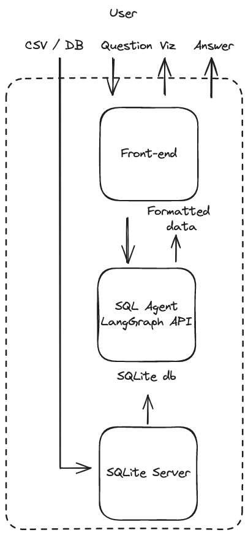
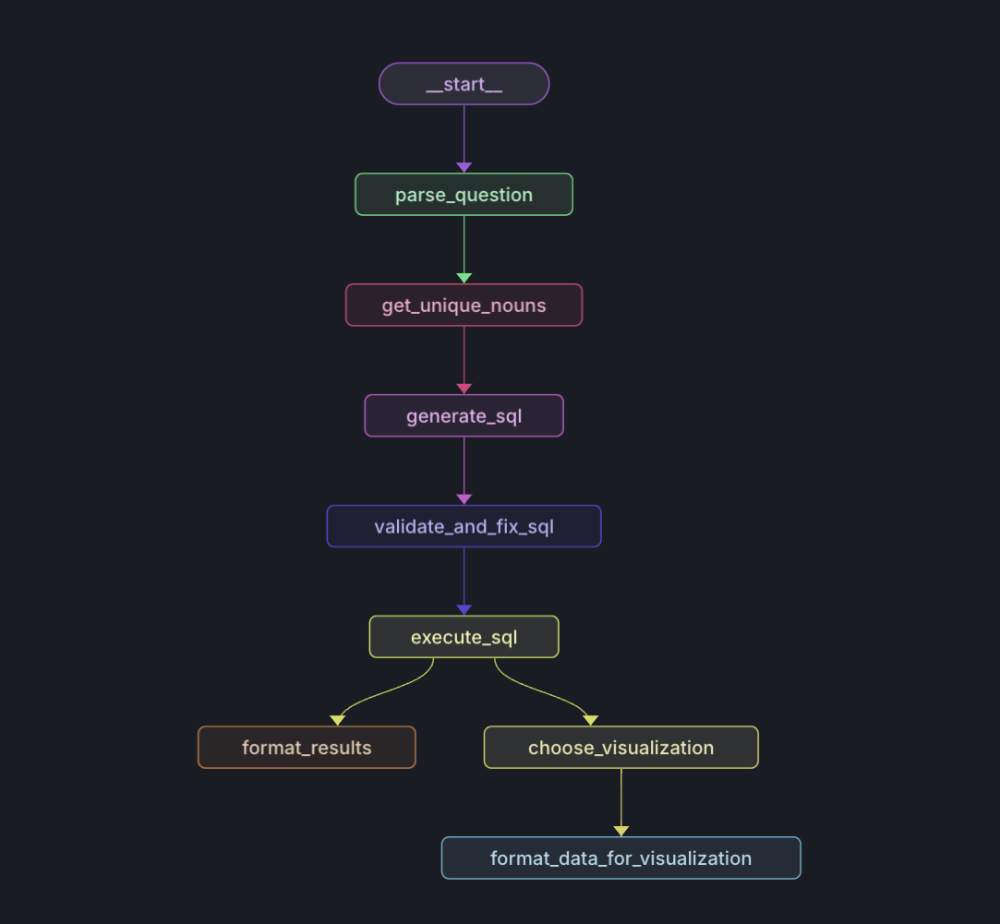
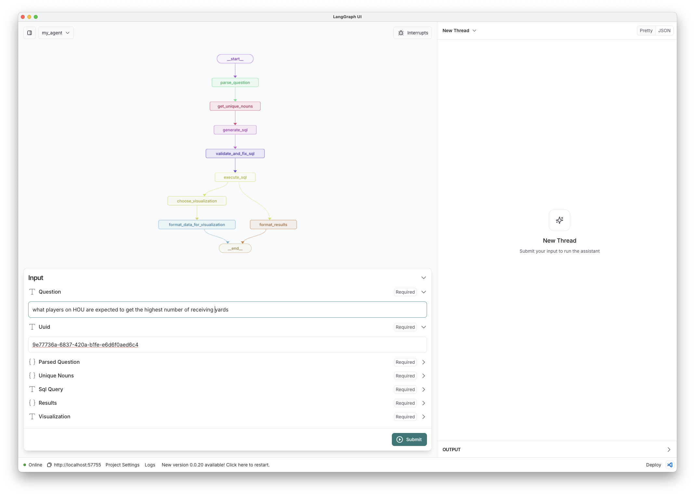

# SQL Query Visualization Project

This agent bridges the gap between natural language questions and data visualization, allowing users to questions about a dataset and receive insightful visual representations in response. Users can upload a SQLite database or CSV file and ask questions about the data in natural language. The agent generates a SQL query based on the user's question, executes it on the database, and formats the results into a visual representation. The project is deployed [here](https://data-visualization-frontend-gamma.vercel.app/).

[Video Demo](demo.mov)

## Overall Architecture

The workflow is orchestrated using `LangGraph`, which provides a framework for easily building complex AI agents, a streaming API for real-time updates, and a visual studio for monitoring and experimenting with the agent's behavior. Around the LangGraph agent, the workflow uses a `SQLite Server` that supports file (SQLite and CSV) uploads under 1MB and a front-end that has prebuilt graph templates for visualization of data from LangGraph's streaming API. Once the visualization is generated, the user can also see the traces of the workflow provided by LangGraph to inspect the internal state of the agent.



## Agent Architecture

The LangGraph agent is made up of several nodes, visualized in the diagram and explained below. See more details in the blog post [here](https://pear-catboat-4f2.notion.site/Building-a-Data-Visualization-Agent-with-LangGraph-Cloud-3cd220670e40419d9f5cf961eb160514).



#### Parse Question

This node perform query analysis, examining the user question jointly with the database schema to determine if the question is relevant to the database. If relevant, it identifies which tables and columns are needed to answer the question. 

#### Get Unique Nouns

This node focuses on the "noun columns" for each table, which contain non-numeric values. It produces a set of sample values from these columns, which are helps in generating more precise SQL queries by knowing specific values in the database. As explained the blog post [here](https://pear-catboat-4f2.notion.site/Building-a-Data-Visualization-Agent-with-LangGraph-Cloud-3cd220670e40419d9f5cf961eb160514), this can be useful for cases of ambiguous spelling (e.g., a user may ask about the band "ac dc", but the database may contain the name "AC/DC") of entities in the database.

#### Generate SQL

This node generate an SQL query based upon the user's original question, the relevant tables and columns identified earlier, the sampled data (unique nouns) extracted from the database in the above step.

#### Validate and Fix SQL

This node validates the query, ensuring that the SQL query is valid and if all table and column names are correctly spelled and exist in the schema.

#### Execute SQL

This node runs the validated SQL query against the database. 

#### Choose Visualization

This node uses an LLM to choose an appropriate visualization for the data, selecting one of several visualizations (bar, horizontal bar, scatter, pie, line) to use. 

#### Format Results

This node uses an LLM to format the query results into a human-readable / natural language response and runs in parallel with the Format Data for Visualization node.

#### Format Data for Visualization

This node formats the data for the chosen visualization type, which is then used to generate the visualization on the frontend.

## Getting Started

### Prerequisites

- Following the LangGraph Studio setup, install [Docker](https://docs.docker.com/engine/install/)
- Install [LangGraph Studio](https://github.com/langchain-ai/langgraph-studio/)

### Setup

#### SQLite Server

The SQLite server ([see project](https://github.com/DhruvAtreja/sqllite-server)) allows uploading of SQL and CSV files under 1MB and serves two purposes: querying the database and retrieving its schema. It converts the uploaded CSV files into a SQLite database, and assigns a UUID to the database. The uploaded databases are stored in the `sqlite_server/uploads` folder. It also uses a default database [here](https://docs.google.com/spreadsheets/d/1S2mYAKwYYmjZW6jURiAfMWTVmwg74QQDfwdMUvVEgMk/edit?gid=1749607041#gid=1749607041) if you user does not upload any file. Run these steps:

```
$ cd sqlite_server
$ yarn install
$ yarn start
```

#### Backend

You can use `backend_js` or `backend_py` as your backend. If using python, for example, the LangGraph agent is defined in `backend_py/my_agent`. This defines the logic within each node of the SQL agent, following the steps explained above. The [LangGraph API](https://github.com/langchain-ai/langgraph-api) can be used to wrap this code, providing a back-end to our application. We can run this locally using [LangGraph Studio](https://github.com/langchain-ai/langgraph-studio), which simply involves loading the `backend_py/my_agent` folder as a project in the LangGraph Studio Desktop application. The below steps show how to run the backend locally.

1. **Create a `.env` file** 

If using python backend, for example, you can use `backend_py/.env.example` as a template. When we load the project into LangGraph Studio, Studio will package our code with the LangGraph API and run it in a containerized Docker environment that needs access to certain environment variables provided by the `.env` file. We need the containerized LangGraph API backend to communicate with the SQLite server running on our host machine, so `host.docker.internal` resolves to the IP address of the host machine running Docker, allowing connection to the the SQLite server.

```
$ echo "OPENAI_API_KEY=your_actual_api_key_here
DB_ENDPOINT_URL=http://host.docker.internal:3001" > backend_py/.env
```

2. **Start Studio** 

If using python locally, for example, open the `backend_py/my_agent` as a project in the LangGraph Studio desktop applications. Studio gives us direct access to the LangGraph API via a URL that is visible in the lower left corner of the Studio UI. Note that we can also use [LangGraph Cloud](https://langchain-ai.github.io/langgraph/cloud/) to deploy and host our back-end.

#### Frontend

After you have LangGraph Studio running locally, proceed with the frontend setup.

1. **Create a `.env` file** 

You can use `frontend/.env.example` as a template. Here, `LANGGRAPH_API_URL` is the URL you will find in the LangGraph Studio UI, as mentioned above, which gives the frontend access to the LangGraph API.

```
$ echo "NEXT_PUBLIC_SQLITE_URL=http://localhost:3001
LANGGRAPH_API_URL=xxx" > frontend/.env
```

2. **Start the frontend** 
```
$ cd frontend
$ yarn install
$ yarn dev
````

Now, the frontend is running at `http://localhost:3000`. By default, you can use [this sample dataset](https://docs.google.com/spreadsheets/d/1S2mYAKwYYmjZW6jURiAfMWTVmwg74QQDfwdMUvVEgMk/edit?gid=1749607041#gid=1749607041) in the UI. But, you can also upload your own CSV or SQLite file.

## Usage

### Using the Frontend

1. Navigate to the frontend URL (`http://localhost:3000` by default)
2. Upload a SQLite or CSV file under 1 MB, or just ask a question using the [sample dataset](https://docs.google.com/spreadsheets/d/1S2mYAKwYYmjZW6jURiAfMWTVmwg74QQDfwdMUvVEgMk/edit?gid=1749607041#gid=1749607041)
3. Enter a natural language query
4. View the stream of the graph state and then the generated visualization
5. Optionally, view the query execution traces

### Using the LangGraph Studio

To use the Studio UI, simply input the question and the UUID of the database, which is `921c838c-541d-4361-8c96-70cb23abd9f5` for the [sample dataset](https://docs.google.com/spreadsheets/d/1S2mYAKwYYmjZW6jURiAfMWTVmwg74QQDfwdMUvVEgMk/edit?gid=1749607041#gid=1749607041). You can see UUIDs for all uploaded files in `sqlite_server/uploads`. Below is an example visualization on an uploaded dataset, with ID retrieved from `sqlite_server/uploads`.



## Contributing

Contributions are welcome! Please feel free to submit a Pull Request.
